  

  

  
  

---

### 🚀 Hakkımda

- 🎓 **GDG On Campus Doğuş University** topluluğunda aktifim
- 💻 Python, Java ve JavaScript ile geliştirme yapıyorum
- 📊 Veri analizi ve görselleştirme ile ilgileniyorum (Pandas, NumPy, Matplotlib, Seaborn)
- 🌱 Yeni teknolojiler öğrenmeye ve projeler geliştirmeye devam ediyorum
- 📍 İstanbul, Türkiye

---

### 🛠️ Teknoloji Yığınım

  
  
  
  
  
  
  
  
  

---

### 📌 Öne Çıkan Projelerim

  

---

### 📊 GitHub İstatistiklerim

  

---

### 📈 Katkı Grafiğim

  

---

### 👁️ Profil Görüntülenme

  

  

