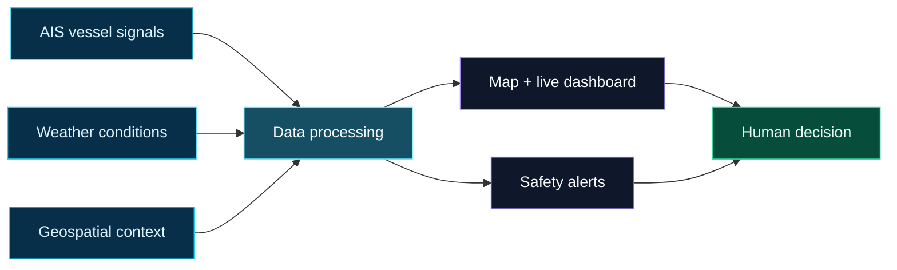

<div align="center">


<br />

<a href="https://github.com/KeremKalyoncu?tab=repositories">
  
</a>
<a href="https://keremkalyoncu.github.io/maritime-watch">
  
</a>
<a href="https://github.com/KeremKalyoncu?tab=followers">
  
</a>

<br /><br />


</div>

<br />

<!--
  Navigation
-->

<div align="center">

`[ about ]` · `[ focus ]` · `[ projects ]` · `[ stack ]` · `[ stats ]` · `[ contact ]`

</div>

<br />

## `01` / About the builder

I’m **Kerem Kalyoncu**, a Software Engineer based in **İstanbul, Türkiye**.

I like building at the point where **software meets the real world**: live data, maps, operations, automation and interfaces that make complicated information easier to act on.

I am not interested in shipping software that only looks impressive in a screenshot. I care about the whole path:

```text
real problem
    ↓
clear information
    ↓
reliable system
    ↓
useful interface
    ↓
measurable outcome
```

<div align="center">

| `CURRENT MODE` | `INTERESTED IN` | `BASED IN` |
| :---: | :---: | :---: |
| `BUILDING` | `DATA × MAPS × AUTOMATION` | `ISTANBUL, TR` |

</div>

## `02` / What I am building toward

<table>
<tr>
<td width="50%" valign="top">

### 🧭 Real-world software

Tools that connect information to action instead of adding another complicated dashboard.

</td>
<td width="50%" valign="top">

### 🌊 Geospatial systems

Maps, location data and live signals turned into experiences people can understand quickly.

</td>
</tr>
<tr>
<td width="50%" valign="top">

### 📡 Live information

Systems that observe changing conditions and surface the signal that matters.

</td>
<td width="50%" valign="top">

### ⚙️ Practical automation

Removing repetitive work with clean application logic, data and integrations.

</td>
</tr>
</table>

## `03` / Featured build — Maritime Watch

<div align="center">

<a href="https://github.com/KeremKalyoncu/maritime-watch">
  
</a>

</div>

> **Maritime Watch** is a real-time marine safety and vessel-awareness platform for Turkish waters. It combines live AIS data, geospatial visualization, weather information and safety-oriented alerts in one focused experience.

<div align="center">

<a href="https://keremkalyoncu.github.io/maritime-watch">
  
</a>
<a href="https://github.com/KeremKalyoncu/maritime-watch">
  
</a>

</div>

### The idea

Maritime data is valuable only when it is understandable at the moment it is needed. Maritime Watch is an experiment in making live vessel movement, environmental conditions and potential risk visible in one place.


```mermaid
flowchart LR
    A[AIS vessel signals] --> D[Data processing]
    B[Weather conditions] --> D
    C[Geospatial context] --> D
    D --> E[Map + live dashboard]
    D --> F[Safety alerts]
    E --> G[Human decision]
    F --> G
    style A fill:#082F49,stroke:#22D3EE,color:#E0F2FE
    style B fill:#082F49,stroke:#22D3EE,color:#E0F2FE
    style C fill:#082F49,stroke:#22D3EE,color:#E0F2FE
    style D fill:#164E63,stroke:#67E8F9,color:#F8FAFC
    style E fill:#0F172A,stroke:#A78BFA,color:#F8FAFC
    style F fill:#0F172A,stroke:#A78BFA,color:#F8FAFC
    style G fill:#064E3B,stroke:#34D399,color:#ECFDF5
```

<details>
<summary><b>⚓ What is inside the project?</b></summary>

<br />

- Live AIS and vessel-tracking concepts
- Geospatial map visualization
- Marine-safety and collision-awareness direction
- Weather data and warning workflows
- Telegram-based alerting direction
- A public live deployment

</details>

<br />

## `04` / Selected work

<table>
<tr>
<td width="50%" valign="top">

### [Dynamic CSS Portfolio](https://github.com/KeremKalyoncu/Dinamik-Css-Portfolyo)

An interactive front-end project focused on visual presentation, layout and JavaScript-driven experience.

`JavaScript` `CSS` `UI`

</td>
<td width="50%" valign="top">

### [Advanced Library System](https://github.com/KeremKalyoncu/Gelismis_Kutuphane_Sistemi)

A Python and SQLite application for books, borrowing workflows, search and activity logging.

`Python` `SQLite` `Business logic`

</td>
</tr>
<tr>
<td width="50%" valign="top">

### [Inventory & Stock Tracking](https://github.com/KeremKalyoncu/Envanter-Stok-Takibi)

A practical system for organizing products, quantities and stock operations.

`Python` `Data` `Automation`

</td>
<td width="50%" valign="top">

### [Fuel Station Automation](https://github.com/KeremKalyoncu/Benzin_Istasyonu_Otamasyon)

A C# application shaped around real operational workflows in a fuel-station domain.

`C#` `Desktop` `Automation`

</td>
</tr>
</table>

<div align="center">

<a href="https://github.com/KeremKalyoncu?tab=repositories">
  
</a>

</div>

## `05` / Technology constellation

<div align="center">


<br /><br />


</div>

<br />

## `06` / Engineering principles

<div align="center">

```text
┌──────────────────────────────────────────────────────────────┐
│  BUILD FOR THE PROBLEM, NOT FOR THE TECHNOLOGY               │
│  MAKE COMPLEX DATA FEEL SIMPLE                               │
│  SHIP A SMALL WORKING VERSION                                │
│  DOCUMENT THE DECISIONS                                      │
│  IMPROVE THE SYSTEM AFTER THE DEMO                            │
└──────────────────────────────────────────────────────────────┘
```

</div>

I’m continuously improving how I design systems, communicate technical decisions and turn experiments into software that someone else can actually use.

## `07` / GitHub telemetry

<div align="center">


<br />


<br /><br />


</div>

<details>
<summary><b>📈 Optional: add the animated contribution layers</b></summary>

<br />

These two visuals require GitHub Actions in the `KeremKalyoncu/KeremKalyoncu` profile repository:

```md
<!-- Contribution snake generated by Platane/snk -->


<!-- 3D contribution calendar generated by yoshi389111/github-profile-3d-contrib -->

```

They should be added only after the workflows generate the files. This keeps the profile fast and avoids broken image placeholders.

</details>

## `08` / Outside the code

I am active around developer communities and keep learning by building. I am especially interested in projects where software has a visible connection to people, places, operations or the physical world.

<div align="center">

`software engineering` · `data visualization` · `geospatial thinking` · `continuous learning`

</div>

## `09` / Open channel

Are you building something with **data, maps, automation, live systems or developer tooling**?

The best way to reach me is through GitHub:

<div align="center">

<a href="https://github.com/KeremKalyoncu">
  
</a>
<a href="https://github.com/KeremKalyoncu?tab=issues">
  
</a>

<br /><br />


</div>

<br />

<div align="center">
  
</div>

<!--
  Setup notes:
  1. Put this file at KeremKalyoncu/KeremKalyoncu/README.md
  2. Put assets/kerem-command-center.svg in the same repository
  3. Replace or remove any social link you do not actively use
  4. Keep the profile repository public
-->
