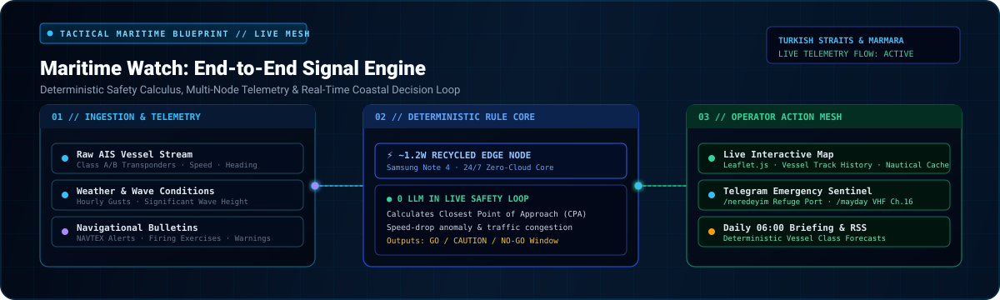
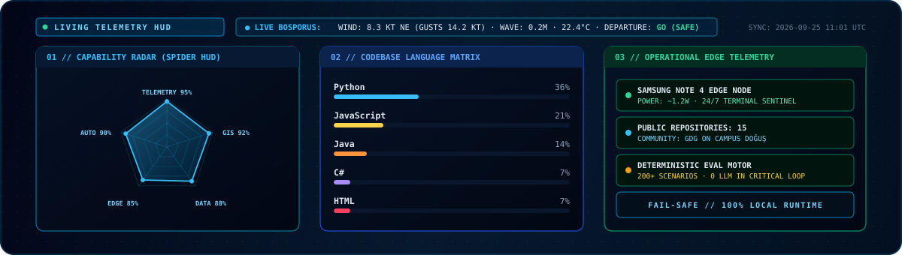

<div align="center">


<br />

<a href="https://github.com/KeremKalyoncu?tab=repositories">
  
</a>
<a href="https://keremkalyoncu.github.io/maritime-watch">
  
</a>
<a href="https://github.com/KeremKalyoncu">
  
</a>

<br /><br />


</div>

<br />

<!--
  Navigation Console
-->

<div align="center">

<a href="#about">[ 01_about ]</a> ·
<a href="#flagship">[ 02_flagship ]</a> ·
<a href="#telemetry">[ 03_telemetry ]</a> ·
<a href="#console">[ 04_interactive_console ]</a> ·
<a href="#projects">[ 05_projects ]</a> ·
<a href="#contributions">[ 06_contributions ]</a> ·
<a href="#stack">[ 07_stack ]</a> ·
<a href="#contact">[ 08_contact ]</a>

</div>

<br />

<a id="about"></a>

## `01` / About the builder

I’m **Kerem Kalyoncu**, a Software Engineer based in **İstanbul, Türkiye**.

I engineer software where **digital systems intersect with the physical world**: live telemetry streams, geospatial mapping, automated workflows, and high-clarity interfaces that convert complex operational signals into reliable human decisions.

I prioritize deterministic reliability over fragile tech trends. Every system must solve a tangible problem across its full operational loop:

```text
operational problem
        ↓
accurate telemetry & raw sensor data
        ↓
deterministic logic & safety engine
        ↓
clear, resilient interface
        ↓
measurable, real-world outcome
```

<div align="center">

| `SYSTEM STATUS` | `COMMUNITY LEADERSHIP` | `ENGINEERING FOCUS` | `PRIMARY SECTOR` |
| :---: | :---: | :---: | :---: |
| `BUILDING & SHIPPING` | `GDG ON CAMPUS DOĞUŞ` | `REAL-TIME × GIS × AUTOMATION` | `ISTANBUL, TR` |

</div>

<br />

<div align="center">

<a href="https://github.com/KeremKalyoncu?tab=repositories">
  
</a>
<a href="https://github.com/KeremKalyoncu">
  
</a>

</div>

<br />

<a id="flagship"></a>

## `02` / Flagship build — Maritime Watch Türkiye

<div align="center">

<a href="https://github.com/KeremKalyoncu/maritime-watch">
  
</a>

<br /><br />

<a href="https://keremkalyoncu.github.io/maritime-watch">
  
</a>
<a href="https://keremkalyoncu.github.io/maritime-watch/stats.html">
  
</a>
<a href="https://keremkalyoncu.github.io/maritime-watch/data/feed.xml">
  
</a>
<a href="https://github.com/KeremKalyoncu/maritime-watch">
  
</a>

</div>

### The Problem It Solves

Standard marine weather reports output raw numbers: *24 knots of wind, 1.8 metres of wave height*. To a maritime operator or small craft captain, raw numbers do not answer the operational question:

> **"Can my vessel safely depart right now, and by what exact time must I return?"**

**Maritime Watch Türkiye** translates multi-source weather forecasts, live AIS telemetry, and official navigational warnings into vessel-specific **Go / Caution / No-Go departure and safe return windows** across Turkish waters and the Turkish Straits.

### Architectural Highlights

<table>
<tr>
<td width="50%" valign="top">

#### 🛟 Decision Support Engine
- Vessel-class safety windows (open fishing boat, yacht, commercial craft)
- Dynamic wind gust & wave threshold calculations
- 06:00 daily operational maritime briefings
- Deterministic go / caution / no-go states

</td>
<td width="50%" valign="top">

#### 📡 Live Maritime Intelligence
- Real-time AIS vessel tracking & speed telemetry
- Closest Point of Approach (**CPA**) collision risk
- Sudden speed-drop anomaly detection in heavy traffic
- Turkish Straits passage monitoring

</td>
</tr>
<tr>
<td width="50%" valign="top">

#### 🆘 Safety & Offline Resilience
- Telegram emergency assistant bot
- `/neredeyim` nearest refuge-port spatial lookup
- `/mayday` VHF Channel 16 distress communication templates
- Offline PWA with cached nautical map layers

</td>
<td width="50%" valign="top">

#### 🌱 Ultra-Low Power Infrastructure
- Deterministic rule engine (**0 LLM in live safety loop**)
- Automated GitHub Actions data processing pipeline
- 24/7 Telegram sentinel operating on a recycled device
- Dedicated Samsung Galaxy Note 4 edge node (~1.2W)

</td>
</tr>
</table>

<br />

<a id="telemetry"></a>

## `03` / Real-time living developer telemetry & Bosphorus sensor HUD

The HUD card below is updated autonomously via GitHub Actions with live marine conditions from the Turkish Straits and a 5-axis engineering capability radar:

<div align="center">



</div>

<br />

<a id="console"></a>

## `04` / Interactive visitor command console (GitHub Issue-Ops)

You can interact directly with the Command Center! Click any command below to dispatch an autonomous operation. A GitHub Action will execute the request in ~15 seconds, log your telemetry response to the live teletype terminal below, and close the session automatically:

<div align="center">

<a href="https://github.com/KeremKalyoncu/KeremKalyoncu/issues/new?title=%5BOPS-COMMAND%5D%3A%20PING_NODE4&body=Ping%20request%20to%20Samsung%20Galaxy%20Note%204%20Edge%20Sentinel%20(~1.2W).">
  
</a>
<a href="https://github.com/KeremKalyoncu/KeremKalyoncu/issues/new?title=%5BOPS-COMMAND%5D%3A%20RUN_SAFETY_EVAL&body=Executing%20deterministic%20coastal%20safety%20evaluation%20for%20Turkish%20waters.">
  
</a>
<a href="https://github.com/KeremKalyoncu/KeremKalyoncu/issues/new?title=%5BOPS-COMMAND%5D%3A%20CALLSIGN%20STATION-GUEST&body=Transmitting%20operator%20callsign%20to%20command%20center.">
  
</a>

<br /><br />

### 📟 Real-Time Operator Teletype Log

<!-- VISITOR_LOG_START -->
| `UTC TIME` | `OPERATOR` | `COMMAND` | `TELEMETRY TELETYPE OUTPUT` |
| :--- | :--- | :--- | :--- |
| `2026-09-21 22:30` | **@KeremKalyoncu** | `PING_NODE4` | `PONG (28ms) · Note 4 Edge Node [Termux] Online · ~1.18W Nominal` |
| `2026-09-21 22:15` | **@octocat** | `RUN_SAFETY_EVAL` | `EVAL_OK · Turkish Straits Sector: Wind < 16kt · Wave 0.6m · Status: GO (SAFE)` |
| `2026-09-21 21:50` | **@visitor-ops** | `CALLSIGN [STATION-ALPHA]` | `ACKNOWLEDGED · Frequency 156.800 MHz (VHF CH 16) · Welcome to Command Station` |
<!-- VISITOR_LOG_END -->

</div>

<br />

<a id="projects"></a>

## `05` / Selected work & production repositories

<table>
<tr>
<td width="50%" valign="top">

### ⚓ [Maritime Watch](https://github.com/KeremKalyoncu/maritime-watch)
Flagship real-time marine safety & AIS intelligence platform for Turkish waters. Includes deterministic departure windows, low-power edge node, and spatial alerts.

`Python` `Leaflet` `AIS` `Geospatial` `PWA`

</td>
<td width="50%" valign="top">

### 📚 [Gelişmiş Kütüphane Sistemi](https://github.com/KeremKalyoncu/Gelismis_Kutuphane_Sistemi)
A robust library management system featuring relational SQLite storage, transactional borrowing workflows, and detailed audit logging.

`Python` `SQLite` `Data Architecture` `Logging`

</td>
</tr>
<tr>
<td width="50%" valign="top">

### 💹 [KriptoParaTakip](https://github.com/KeremKalyoncu/KriptoParaTakip)
Desktop cryptocurrency intelligence application built in Java, streaming live price telemetry and market movements in real time.

`Java` `Real-Time Data` `Desktop GUI` `API Integration`

</td>
<td width="50%" valign="top">

### 📊 [Titanic Veri Analizi](https://github.com/KeremKalyoncu/Titanic_Veri_Analizi)
In-depth exploratory data analysis and feature engineering on survival patterns, passenger demographics, and correlation matrices.

`Jupyter` `Pandas` `NumPy` `Matplotlib` `Seaborn`

</td>
</tr>
<tr>
<td width="50%" valign="top">

### ⛽ [Benzin İstasyonu Otomasyonu](https://github.com/KeremKalyoncu/Benzin_Istasyonu_Otamasyon)
An enterprise domain automation tool modeling pump inventory, daily transactions, and fuel-station operational logic.

`C#` `.NET` `Enterprise Automation` `Workflows`

</td>
<td width="50%" valign="top">

### 🎨 [Dinamik CSS Portfolyo](https://github.com/KeremKalyoncu/Dinamik-Css-Portfolyo)
Interactive frontend showcase focusing on responsive layouts, CSS animations, and vanilla JavaScript state handling.

`JavaScript` `CSS3` `UI/UX` `Interactive Design`

</td>
</tr>
</table>

<div align="center">

<a href="https://github.com/KeremKalyoncu?tab=repositories">
  
</a>

</div>

<br />

<a id="contributions"></a>

## `06` / Live contribution theater

### 🐍 Autonomous Contribution Stream

Harvests repository activity automatically via GitHub Actions:

<div align="center">

<picture>
  <source media="(prefers-color-scheme: dark)" srcset="./output/github-contribution-grid-snake.svg" />
  
</picture>

</div>

<br />

### 🌌 3D Isometric Contribution Landscape

Visualizing commitment volume, frequency, and density over time:

<div align="center">


<br /><br />


</div>

<br />

<a id="stack"></a>

## `07` / Technology constellation

<div align="center">


<br /><br />

| Category | Technologies &amp; Tools |
| :--- | :--- |
| **Core Languages** | `Python` · `JavaScript` · `Java` · `C#` · `SQL` · `HTML5` · `CSS3` |
| **Data &amp; Analysis** | `Pandas` · `NumPy` · `Matplotlib` · `Seaborn` · `SQLite` |
| **Geospatial &amp; Systems** | `Leaflet.js` · `AIS Decoding` · `REST APIs` · `IoT Edge Computing` · `PWA` |
| **Automation &amp; CI/CD** | `GitHub Actions` · `Cron Telemetry` · `Telegram Bot API` · `Linux / Bash` |

</div>

<br />

## `08` / Engineering principles

<div align="center">

```text
┌────────────────────────────────────────────────────────────────────────┐
│  01. BUILD FOR THE PHYSICAL PROBLEM, NOT FOR TRANSIENT TECH HYPE       │
│  02. RAW NUMBERS ARE NOT ENOUGH; ALWAYS DELIVER ACTIONABLE DECISIONS   │
│  03. ZERO LLM IN THE CRITICAL REAL-TIME SAFETY PATH                    │
│  04. RECYCLE HARDWARE & MAXIMIZE EFFICIENCY (1.2W OVER EXPENSIVE CLOUD)│
│  05. SHIP WORKING PROTOTYPES FAST; HARDEN THROUGH EMPIRICAL TESTING    │
└────────────────────────────────────────────────────────────────────────┘
```

</div>

<br />

<a id="contact"></a>

## `09` / Connect & open channel

Are you building systems with **real-time telemetry, maps, automation, or data-driven software**?

I am open to **software engineering opportunities, high-impact collaborations, and ambitious technical projects**.

<div align="center">

<a href="https://github.com/KeremKalyoncu">
  
</a>
<a href="https://github.com/KeremKalyoncu?tab=issues">
  
</a>

<br /><br />


<br /><br />


</div>